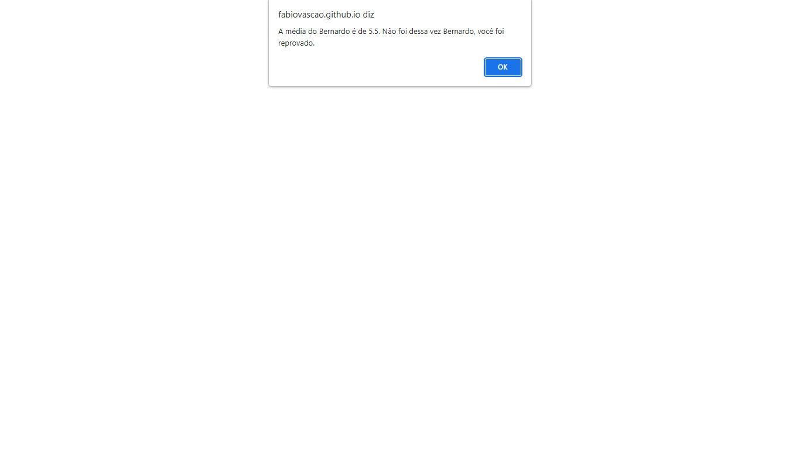

# Desafio Exercício 02

Desafio do Stage04 que faz parte do Programa Explorer da Rocketseat  

Principais pontos abordados nesse desafio: 

- Estrutura de dados com objetos;
- Estrutura de repetição;
- Criação de funções;
- Operadores comparativos;

Nesse desafio você irá criar uma lista de **estudantes** e, cada estudante dentro dessa lista, deverá conter os seguintes dados: 

- nome;
- nota da primeira prova;
- nota da segunda prova.

Depois de criada a lista: 

- [ ]  Crie uma **função** que irá calcular a média das notas de cada aluno;
- [ ]  Supondo que a média, para esse concurso é **7**, verifique **se** cada aluno obteve sucesso ou não em entrar no concurso e mostre uma mensagem na tela.

## Screenshots

[🔗 Clique aqui para acessar o Projeto](https://fabiovascao.github.io/JavaScript-Desafio2/)  

## 🛠 Tecnologias

- HTML
- CSS
- Git e Github
- JavaScript

## Autor

- [@FabioVascão](https://www.github.com/fabiovascao)